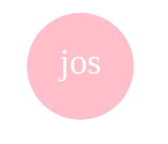
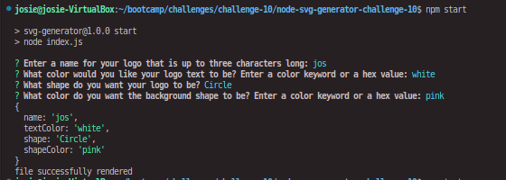
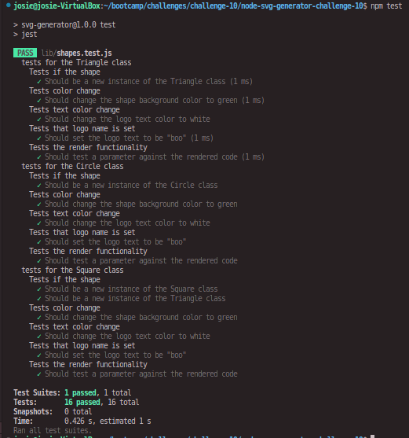

# Node SVG Logo Generator Challenge-10

## Description
For this assignment, I was tasked with creating an SVG generator to create simple logos for web development projects. Similarly to my command line README generator, to do this I used node.js, a prompt using inquirer for user input, and used functions to render that information from the prompt's user input using template literals in the appropiate markdown for an SVG file.

## Table of Contents
- [Installation](#installation)
- [Usage](#usage)
- [Credits](#credits)
- [Screenshots](#screenshots)
- [Video Walkthrough](#videowalkthrough)
- [Tests](#tests)
    

## Installation
- Clone github repository
- Type nym i or npm install in terminal to install necessary dependencies.

## Usage
- To use this generator, first follow the installation steps.
- To begin, run node index.js or npm run start.
- Answer the questions. Fill in information according to how you want your SVG logo to look. (Colors accepted as keywords and as hex values)
- Your generated SVG file will appear under the examples folder in the directory, under the name of your logo as you entered it. 'name.svg'

## Screenshots
SVG generated in video demo:

Prompt return in the terminal:

Tests ran and passing in the terminal:

---
## Video Walkthrough
This video shows usage and funtionality only. For installation, follow steps above under **Installation**. [Google Drive](https://drive.google.com/file/d/1q4CRX-M0cmAGzSK6EKHfWTclgCqj854D/view)

## Tests
Tests are available for all shape classes. To test the working functionality of your code, type npm test or jest into the terminal to run the testing suites in jest. The results of the tests will be logged in the terminal and can be accessed there.
